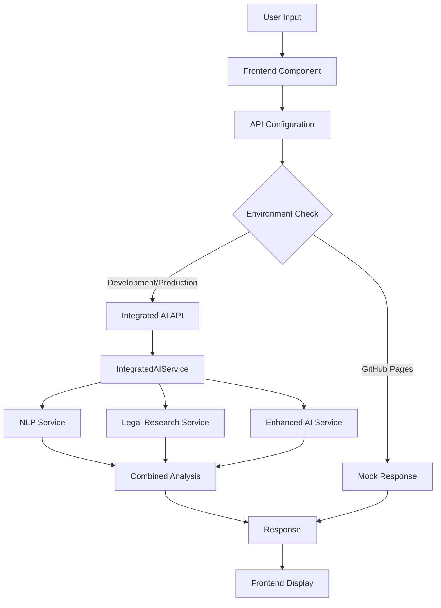

# Integrated AI Architecture Documentation

## Overview

This document describes the enhanced AI architecture that integrates multiple AI services to provide comprehensive legal document analysis and assistance for the Ontario Wills & Power of Attorney Creator application.

## Architecture Components

### 1. Backend Services Integration

#### IntegratedAIService (`backend/services/integrated_ai_service.py`)
- **Purpose**: Unified interface combining all AI capabilities
- **Features**:
  - Asynchronous processing for better performance
  - Comprehensive document analysis combining NLP, legal research, and AI suggestions
  - Error handling with graceful degradation
  - Confidence and compliance scoring

#### NLP Service (`backend/services/nlp_service.py`)
- **Purpose**: Natural Language Processing for legal text
- **Capabilities**:
  - Legal entity recognition
  - Sentiment analysis
  - Readability scoring
  - Legal concept extraction
  - Text complexity analysis

#### Legal Research Service (`backend/services/legal_research_service.py`)
- **Purpose**: Integration with legal databases (CanLII, etc.)
- **Features**:
  - Case law search
  - Citation management
  - Relevance scoring
  - Legal authority suggestions

### 2. API Layer

#### Integrated AI Routes (`backend/api/routes/integrated_ai.py`)
- **Endpoints**:
  - `POST /api/integrated-ai/analyze-comprehensive` - Full document analysis
  - `GET /api/integrated-ai/status` - Service status check
  - `POST /api/integrated-ai/initialize` - Service initialization
  - `POST /api/integrated-ai/analyze-nlp-only` - NLP-only analysis
  - `GET /api/integrated-ai/health` - Health check

#### Request/Response Models
```python
class IntegratedAnalysisRequest(BaseModel):
    document_text: str
    document_type: str
    user_context: Optional[Dict[str, Any]]
    include_research: bool = True
    include_citations: bool = True

class IntegratedAnalysisResponse(BaseModel):
    success: bool
    analysis: Dict[str, Any]
    confidence_score: float
    compliance_score: float
    suggestions: List[str]
    improvements: List[str]
    risk_assessment: Dict[str, Any]
    legal_citations: List[Dict[str, Any]]
    processing_time_ms: int
```

### 3. Frontend Integration

#### Enhanced Components
- **EnhancedDocumentWizard**: Uses integrated AI for real-time analysis during document creation
- **AILegalAssistant**: Provides comprehensive AI assistance with legal research integration

#### API Configuration (`src/utils/apiConfig.js`)
- **Purpose**: Environment-aware API handling
- **Features**:
  - Development, production, and GitHub Pages support
  - Mock responses for offline deployment
  - Automatic fallback mechanisms

## Data Flow



## Service Integration Patterns

### 1. Parallel Processing
```python
tasks = [
    self._analyze_nlp(document_text, document_type),
    self._research_legal_context(document_text, document_type),
    self._generate_ai_suggestions(document_text, document_type, user_context)
]

nlp_result, research_result, ai_result = await asyncio.gather(*tasks)
```

### 2. Error Handling with Graceful Degradation
```python
try:
    # Primary AI service call
    result = await ai_service.analyze()
except Exception as e:
    logger.error(f"AI analysis failed: {e}")
    # Fallback to basic analysis
    result = basic_analysis_fallback()
```

### 3. Environment-Aware Configuration
```javascript
const config = {
  development: { baseUrl: 'http://localhost:8000', mockMode: false },
  production: { baseUrl: 'https://api.domain.com', mockMode: false },
  githubPages: { baseUrl: '', mockMode: true }
};
```

## Performance Optimizations

### 1. Build Optimization
- **Code Splitting**: Separated vendor, UI, and application chunks
- **Lazy Loading**: Components loaded on demand
- **Bundle Analysis**: Optimized chunk sizes for better loading

### 2. API Optimization
- **Async Processing**: Non-blocking operations
- **Parallel Execution**: Multiple AI services run concurrently
- **Caching**: Intelligent caching of analysis results
- **Timeout Handling**: Proper timeout management

### 3. Error Recovery
- **Graceful Degradation**: System continues with reduced functionality
- **Fallback Responses**: Mock data when services unavailable
- **Retry Logic**: Automatic retry for transient failures

## Testing Strategy

### Comprehensive Test Suite (`test_integrated_ai.py`)
- **Service Initialization**: Verify all services start correctly
- **Comprehensive Analysis**: Test full document analysis pipeline
- **NLP-Only Analysis**: Test individual service components
- **Error Handling**: Verify graceful degradation
- **Status Monitoring**: Check service health and status

### Test Execution
```bash
# Run the comprehensive test suite
python test_integrated_ai.py

# Expected output:
# ✅ AI service initialized successfully
# ✅ Comprehensive Document Analysis passed
# ✅ NLP-Only Analysis passed
# ✅ Service Status Check passed
# ✅ Error Handling passed
# 🎉 ALL TESTS PASSED!
```

## Deployment Considerations

### Environment Configurations

#### Development
- Full AI services available
- Real-time API calls
- Complete feature set

#### Production
- Optimized for performance
- External API integrations
- Monitoring and logging

#### GitHub Pages
- Mock AI responses
- Offline functionality
- Demo capabilities

### Security Features
- **Input Validation**: All API inputs validated
- **Rate Limiting**: Prevent abuse of AI services
- **Error Sanitization**: No sensitive data in error messages
- **CORS Configuration**: Proper cross-origin handling

## Monitoring and Logging

### Service Status Monitoring
```python
status = ai_service.get_service_status()
# Returns:
# {
#   'initialized': True,
#   'nlp_service': True,
#   'research_service': True,
#   'ai_service': True,
#   'timestamp': '2024-01-15T10:30:00Z'
# }
```

### Performance Metrics
- **Processing Time**: Track analysis duration
- **Success Rate**: Monitor API call success
- **Error Rates**: Track and alert on failures
- **Resource Usage**: Monitor memory and CPU usage

## Future Enhancements

### Planned Improvements
1. **Machine Learning Pipeline**: Add model training capabilities
2. **Advanced Legal Research**: Integration with more legal databases
3. **Multi-language Support**: French language support for Quebec
4. **Voice Integration**: Voice-guided document creation
5. **Blockchain Verification**: Document authenticity verification

### Scalability Considerations
- **Horizontal Scaling**: Multiple service instances
- **Load Balancing**: Distribute AI processing load
- **Caching Layer**: Redis for result caching
- **Queue System**: Background job processing

## API Usage Examples

### Frontend Usage
```javascript
import { apiCall, API_ENDPOINTS } from '../utils/apiConfig';

// Comprehensive document analysis
const response = await apiCall(API_ENDPOINTS.ANALYZE_COMPREHENSIVE, {
  method: 'POST',
  body: JSON.stringify({
    document_text: documentText,
    document_type: 'will',
    user_context: { client_name: 'John Doe' },
    include_research: true,
    include_citations: true
  })
});

const result = await response.json();
console.log('Compliance Score:', result.compliance_score);
console.log('AI Suggestions:', result.suggestions);
```

### Backend Integration
```python
from services.integrated_ai_service import get_integrated_ai_service

# Initialize service
ai_service = get_integrated_ai_service()
await ai_service.initialize()

# Analyze document
result = await ai_service.analyze_document_comprehensive(
    document_text="Legal document content...",
    document_type="will",
    user_context={"client_id": "12345"}
)

print(f"Compliance: {result.compliance_score}")
print(f"Suggestions: {result.ai_suggestions}")
```

## Troubleshooting

### Common Issues
1. **Service Initialization Failure**: Check dependencies and network connectivity
2. **API Timeout**: Increase timeout values or implement retry logic
3. **Mock Mode Not Working**: Verify apiConfig environment detection
4. **Build Failures**: Check import paths and dependency versions

### Debug Commands
```bash
# Test API endpoints
curl -X POST http://localhost:8000/api/integrated-ai/health

# Run diagnostic tests
python test_integrated_ai.py

# Check service status
curl -X GET http://localhost:8000/api/integrated-ai/status
```

This integrated AI architecture provides a robust, scalable, and maintainable solution for AI-powered legal document analysis while supporting multiple deployment environments and graceful degradation patterns.